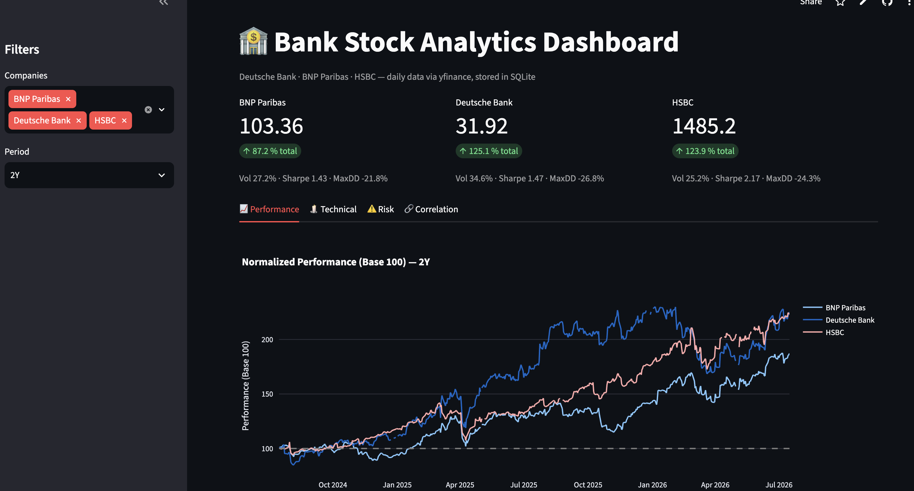
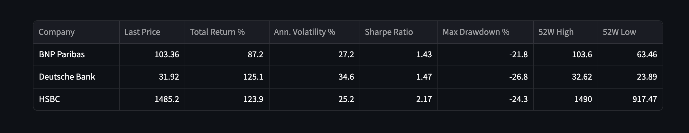
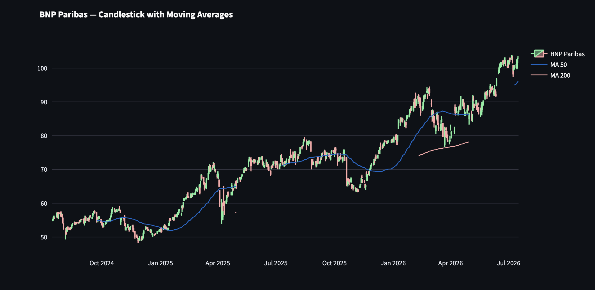
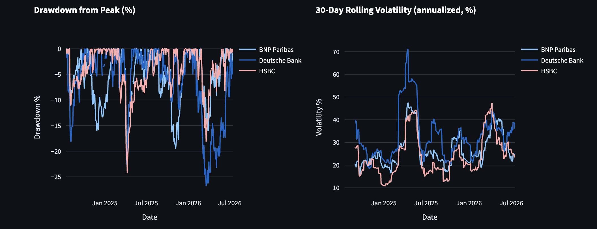
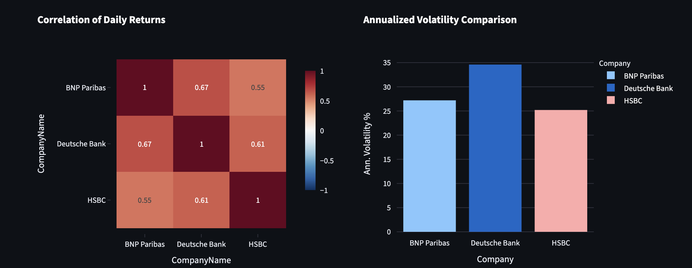

# 🏦 Bank Stock Analytics — End-to-End Financial Data Analysis

An end-to-end data analytics project analyzing two years of stock performance for three major European banks — **Deutsche Bank (DBK.DE)**, **BNP Paribas (BNP.PA)** and **HSBC (HSBA.L)** — from automated data collection to a deployed interactive dashboard.

### 🔗 [**View the live dashboard →**](https://bank-stock-analytics.streamlit.app/)



## 🎯 What this project demonstrates

- **Data engineering** — automated collection via the yfinance API into a normalized SQLite database (long format: one row per date per ticker)
- **Data quality** — documented cleaning pipeline covering missing values, duplicates and outlier flagging
- **Financial analytics** — returns, annualized volatility, Sharpe ratio, maximum drawdown, moving averages, rolling volatility, correlation analysis
- **BI & visualization** — interactive four-tab dashboard built with Streamlit and Plotly
- **Engineering practices** — modular code, separation of concerns, version control, reproducible setup, live deployment

## 🛠️ Tech Stack

`Python 3.13` · `pandas` · `NumPy` · `SQLite` · `Plotly` · `Streamlit` · `yfinance` · `Git`

## 📊 Key Insights (July 2024 – July 2026)

| Company | Last Price | Total Return | Ann. Volatility | Sharpe Ratio | Max Drawdown |
|---|---|---|---|---|---|
| BNP Paribas | 103.36 | +87.2 % | 27.2 % | 1.43 | −21.8 % |
| Deutsche Bank | 31.92 | +125.1 % | 34.6 % | 1.47 | −26.8 % |
| HSBC | 1485.20 | +123.9 % | 25.2 % | **2.17** | −24.3 % |

- **Deutsche Bank delivered the highest absolute return (+125 %)** — but also carried the highest volatility (34.6 %) and the deepest drawdown (−26.8 %).
- **HSBC was the strongest risk-adjusted performer.** It matched Deutsche Bank's return (+124 %) at the lowest volatility of the three, producing a Sharpe ratio of 2.17 versus 1.47. For a risk-conscious mandate, HSBC — not Deutsche Bank — was the better investment.
- **All three banks are highly correlated (0.55 – 0.67).** A portfolio of these names offers little protection against sector-wide shocks; diversification would require exposure outside European banking.
- **Two systemic stress events are visible in the data.** A sharp single-day dislocation in April 2025 (HSBC −24 % from peak) and a broader, slower drawdown across all three names in early 2026.
- **Deutsche Bank's rolling volatility spiked to 71 %** during the 2025 stress period — more than double its long-run average, and the highest reading in the dataset.
- **Daily returns show fat tails.** The distribution is far from normal, with outlier moves beyond ±5 % occurring more often than a Gaussian assumption would predict — relevant for any VaR-style risk estimate.

## 📈 Dashboard

**Performance** — normalized comparison (base 100) with period and company filters


**Technical** — candlestick charts with 50-day and 200-day moving averages


**Risk** — drawdown from peak, 30-day rolling volatility, return distribution


**Correlation** — correlation heatmap and volatility comparison


## 📁 Project Structure

```
bank-stock-analytics/
├── data_collection.py   # Step 1 — download OHLCV data → SQLite
├── data_cleaning.py     # Step 2 — data-quality pipeline → stock_prices_clean
├── kpi_analysis.py      # Step 3 — EDA statistics + financial KPIs
├── dashboard.py         # Step 4 — interactive Streamlit dashboard
├── requirements.txt
└── screenshots/
```

## 🚀 Run Locally

```bash
git clone https://github.com/carloo1997/bank-stock-analytics.git
cd bank-stock-analytics
pip install -r requirements.txt

python3 data_collection.py   # fetch data & build the database
python3 data_cleaning.py     # clean the data
python3 kpi_analysis.py      # print KPI summary
streamlit run dashboard.py   # launch the dashboard
```

The dashboard opens at `http://localhost:8501`.

## 👤 Author

**Carlo Brakonier** — Certified Data Analyst (IHK Munich)
Open to Data Analyst roles in the financial sector.

## ⚠️ Disclaimer

Educational portfolio project. Not investment advice.
